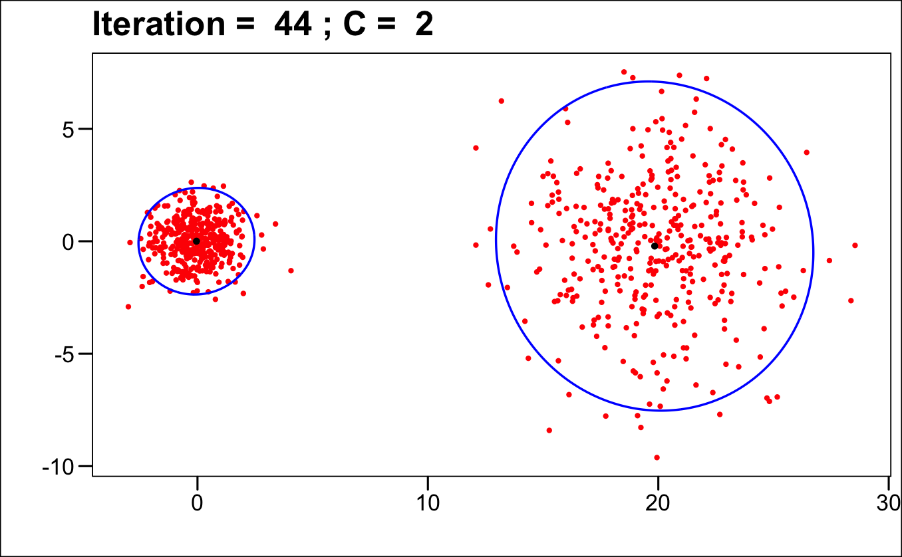
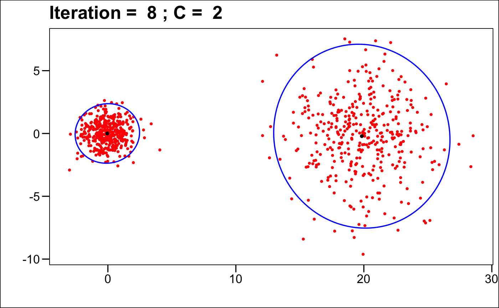
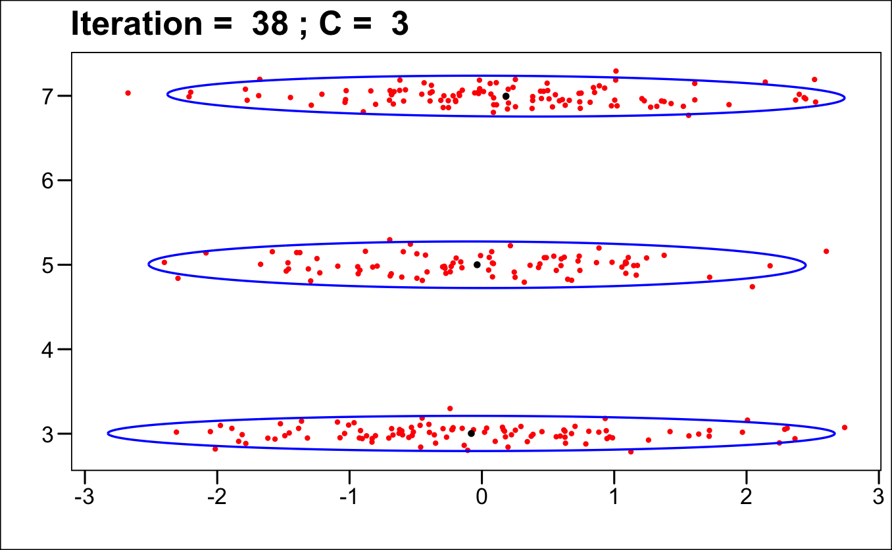
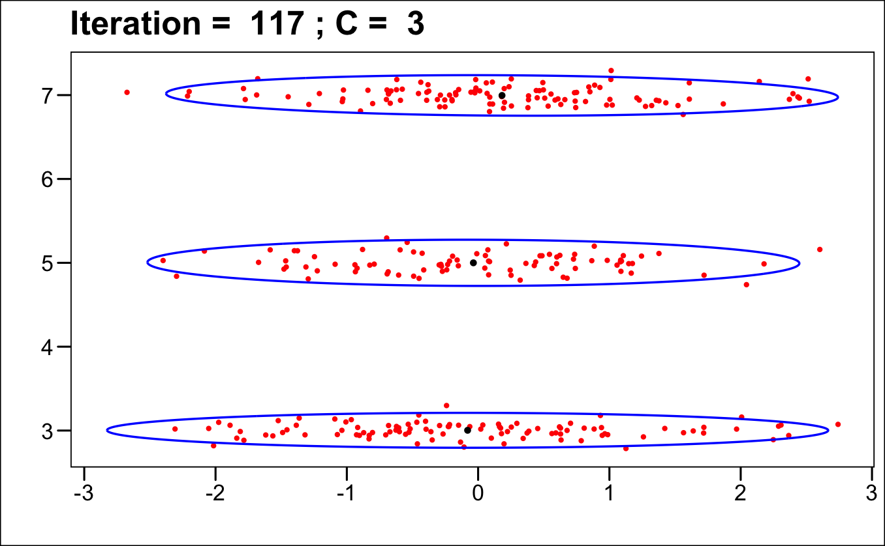
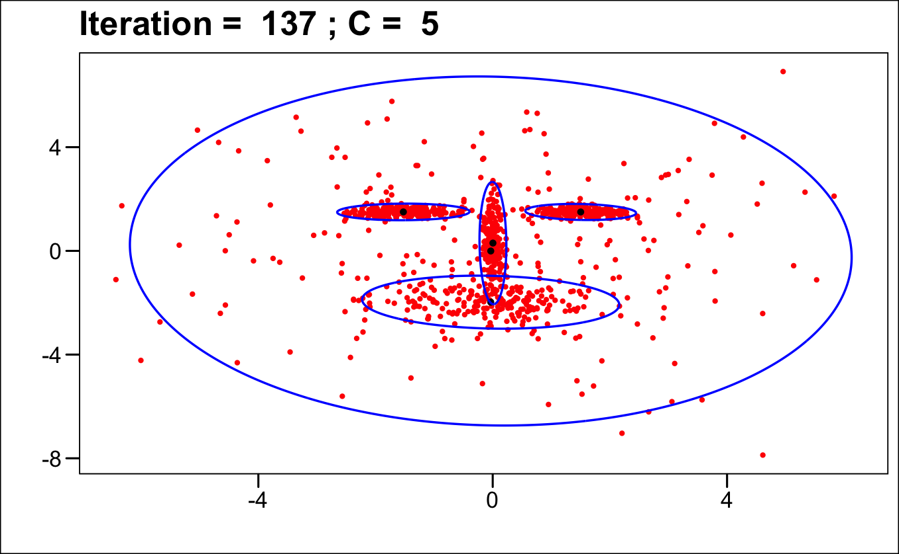
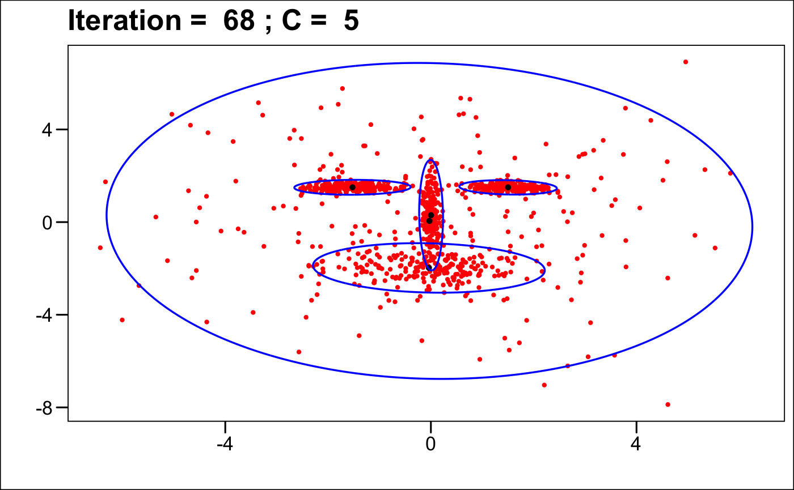
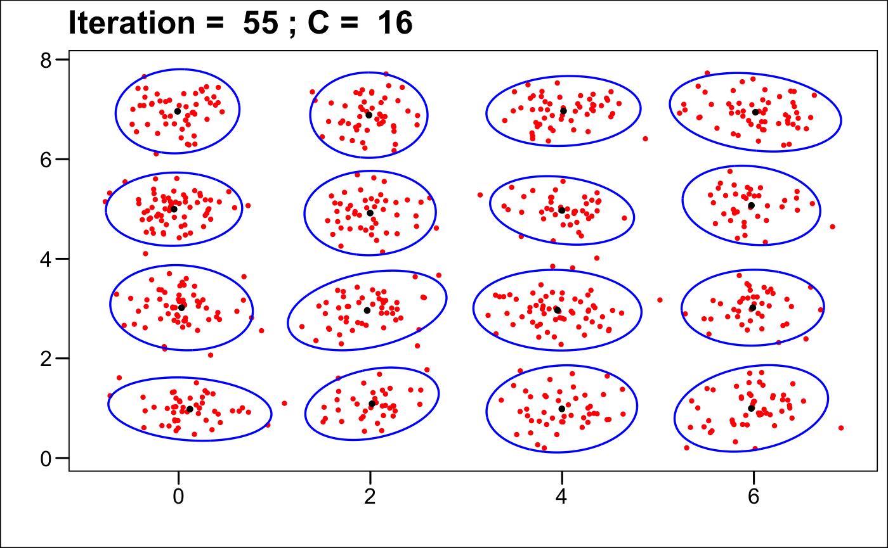
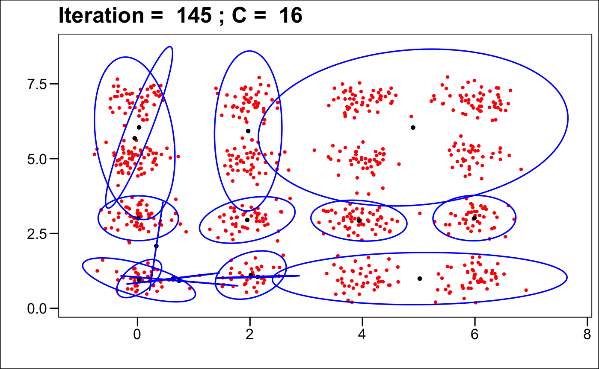

# Directory
- [Introduction](#robust-em-clustering-algorithm)
- [Authors](#authors)
- [Required Packages](#required-packages)
- [Features](#features)
- [Simulation Results](#simulation-results)
- [References](#references)

# Robust EM Clustering Algorithm
This repository contains the implementation of a Robust Expectation-Maximization (Robust EM) Clustering algorithm designed for Gaussian mixture models proposed by Miin-Shen Yang, Chien-Yo Lai, and Chih-Ying Lin ([2012](#ref-EM_cluster)) . The project includes examples of clustering Gaussian mixture models and a comparison with standard EM algorithm.

## Authors
* Yuxin Liu
* Yijia Xue
* Chenguang Yang

## Required Packages
``` r
library(mvtnorm)
library(Matrix)
library(ggplot2)
library(ggthemes)
```

## Features
* Robust EM Algorithm: Implements the Robust EM Clustering Algorithm.
* E-Step and M-Step function: Modular functions for the Expectation and Maximization steps.
* EM Algorithm: Implements the standard EM Algorithm.
* Simulation Examples: Four simulation scenarios to demonstrate the robustness of the algorithm on Gaussian mixture data.
* Comparison with Standard EM: Visual and quantitative comparison of results.

## Simulation Results 

<div style="text-align: center;">
  
  <p>Simulation 1 Robust EM</p>
</div>

</br>

<div style="text-align: center;">
  
  <p>Simulation 1 EM</p>
</div>

</br>

<div style="text-align: center;">
  
  <p>Simulation 2 Robust EM</p>
</div>

</br>
<div style="text-align: center;">
  
  <p>Simulation 2 EM</p>
</div>

</br>

<div style="text-align: center;">
  
  <p>Simulation 3 Robust EM</p>
</div>

</br>
<div style="text-align: center;">
  
  <p>Simulation 3 EM</p>
</div>

</br>
<div style="text-align: center;">
  
  <p>Simulation 4 Robust EM</p>
</div>

</br>

<div style="text-align: center;">
  
  <p>Simulation 4 EM</p>
</div>

## References

<div id="refs" class="references">

<div id="ref-EM_cluster">

Miin-Shen Yang, Chien-Yo Lai, and Chih-Ying Lin. 2012. "A Robust EM Clustering Algorithm for Gaussian Mixture Models." *Pattern Recognition* 45: 3950–3961.
<http://dx.doi.org/10.5705/ss.2013.088>.


